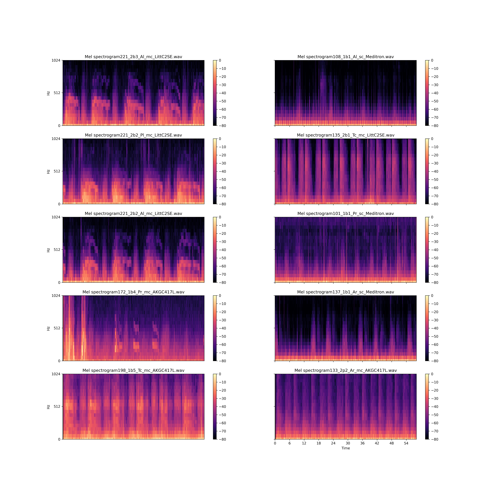
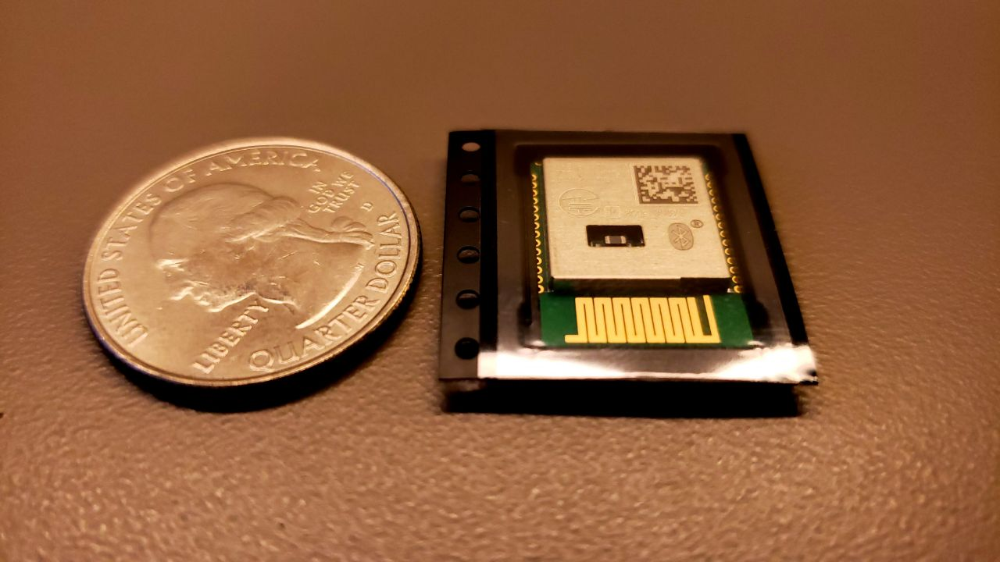
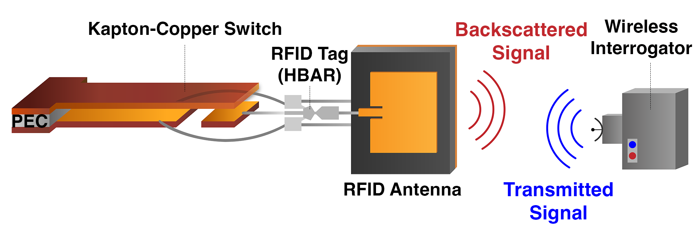
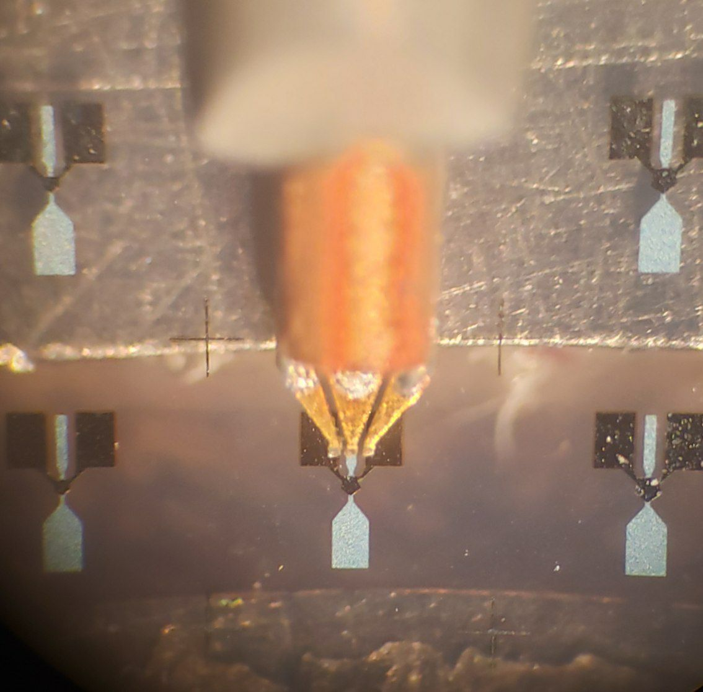
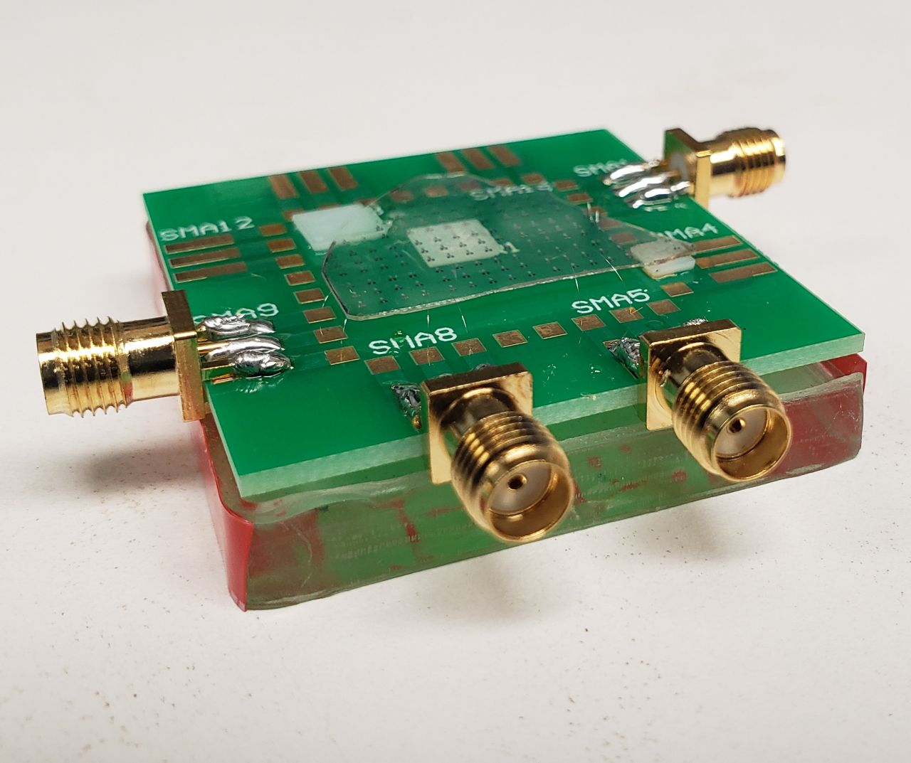
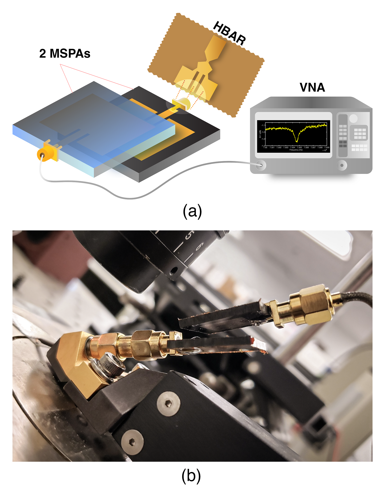
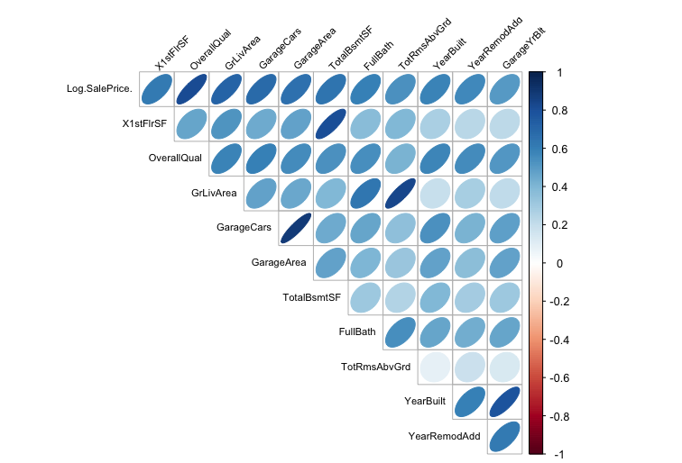
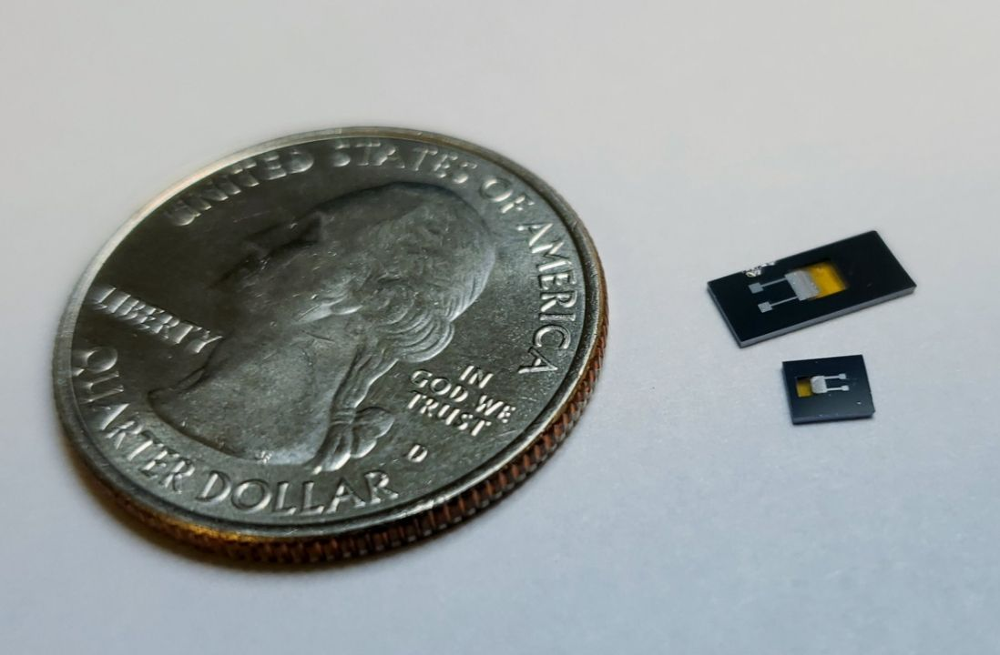

### Matin Barekatain

<!--
**matinak95/matinak95** is a ✨ _special_ ✨ repository because its `README.md` (this file) appears on your GitHub profile.

Here are some ideas to get you started:

- 🔭 I’m currently working on ...
- 🌱 I’m currently learning ...
- 👯 I’m looking to collaborate on ...
- 🤔 I’m looking for help with ...
- 💬 Ask me about ...
- 📫 How to reach me: ...
- 😄 Pronouns: ...
- ⚡ Fun fact: ...
-->

I am a fifth-year Ph.D. candidate in Electrical and Computer Engineering at the ECE Department of the University of Southern California (USC), Los Angeles, CA. 
I work as a Graduate Researcher at the USC Micro-Electro-Mechanical Systems (MEMS) group under the supervision of Prof. Eun Sok Kim. I am just about to complete my second M.Sc. degrees in Computer Science (CS) at the Viterbi School of Engineering of USC where I earned my first M.Sc. degree back in 2020 in Electrical and Computer Engineering both during my Ph.D. program. Before I start my graduate program at USC, I took my BSc degree from the Electrical Engineering department of Sharif University of Technology, Tehran, Iran.

My research areas mainly focus on smart sensors design and implementation, applications for low-power wireless embedded DSP modules, machine learning solutions for sensors, low-power sensing, and AI in Healthcare.

Here is my [CV](Matin_Barekatain_CV.pdf).

Some photos of my recent research works:

  

