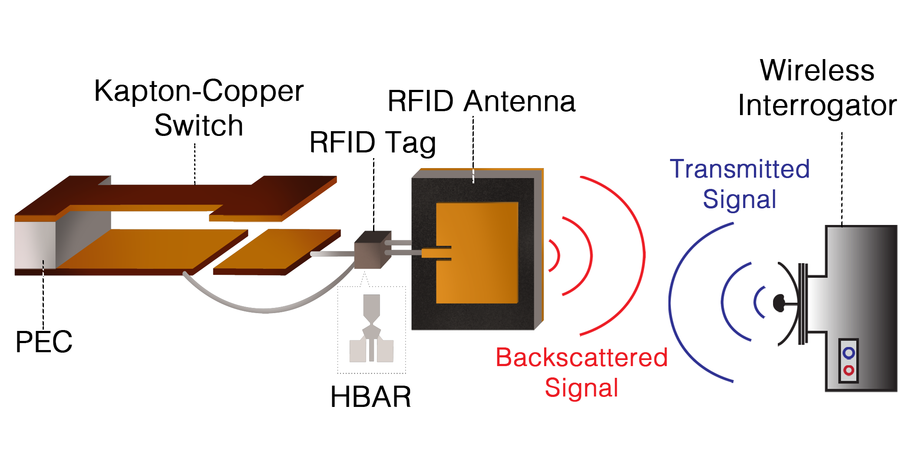
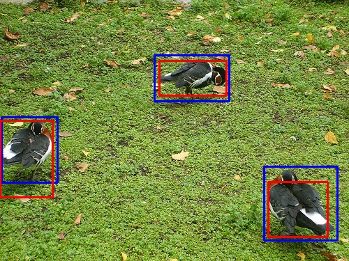

### Matin Barekatain

<!--
**matinak95/matinak95** is a ✨ _special_ ✨ repository because its `README.md` (this file) appears on your GitHub profile.

Here are some ideas to get you started:

- 🔭 I’m currently working on ...
- 🌱 I’m currently learning ...
- 👯 I’m looking to collaborate on ...
- 🤔 I’m looking for help with ...
- 💬 Ask me about ...
- 📫 How to reach me: ...
- 😄 Pronouns: ...
- ⚡ Fun fact: ...
-->

I am a fifth-year Ph.D. student in Electrical and Computer Engineering at the ECE Department of the University of Southern California (USC), Los Angeles, CA. 
I work as a Graduate Researcher at the USC Micro-Electro-Mechanical Systems (MEMS) group under the supervision of Prof. Eun Sok Kim. I am completing both my MSc degrees in ECE and Computer Science (CS) at the Viterbi School of Engineering of USC. Before I start my graduate program at USC, I took my BSc degree from the Electrical Engineering department of Sharif University of Technology, Tehran, Iran.

My research areas mainly focus on solutions for noise-robust classifications for automatic lung sound wheezing detection, machine learning for medical sensing applications, integrated hardware implementation for ultra-low power wearables and IoT-based applications, 5G networks circuit design, wireless IC tamper detection through RFID authentication, and RF design and characteristics.

I brought some photos of my recent works below. I hope you enjoy them :)

  

